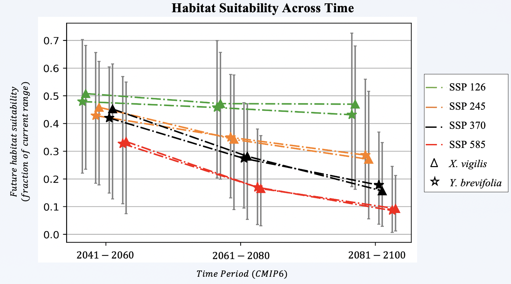

## Assessing Climate Change Impacts on a Pair of Symbiotic Species with Ensemble Species Distribution Models

*What underlying uncertainties are contained in geospatial climate change forecasts? How can models of climate change effects on geographic distributions incorporate symbiotic species relationships?*

---

See the online notebook first: [`Comparing_MLs.ipynb`](https://nbviewer.jupyter.org/github/daniel-furman/ensemble-climate-projections/blob/main/Comparing_MLs.ipynb). All code and data required to reproduce research presented at the SICB 2021 and [SCCUR 2019](https://drive.google.com/file/d/114wmqQgjkc5DHLQmVI19AvlTw4K_daYQ/view?usp=sharing) conferences. Spatial classification was powered by the pyimpute library, see my open-source [contributions](https://github.com/perrygeo/pyimpute/pull/21) therein. Also see my corresponding <a target="_blank" rel="noopener noreferrer" href="https://daniel-furman.github.io/py-sdms-tutorial/"> tutorial</a> on predicting geospatial distributions with machine learning models in Python.

### Introduction to Study
---

**Definitions**

* Niche: An envelope of abiotic and biotic factors suitable to the survival of a species
* SDMs: Associates presence locations to environmental variables to estimate niche
* Workflow: `Data pre-processing` -> `Model fitting` -> `Assessment` -> `Baseline interpolation (1970-2000)` -> `Extrapolate across time`

 

**Question 1: *What underlying uncertainties are contained in geospatial climate change forecasts?*** The distribution models were extrapolated across eight Global Climate Models, four shared socioeconomic pathways, and three bi-decade periods. Habitat with suitable underlying climatic conditions for X. vigilis declined from ~51% to ~9.3% of its current range, akin to range restrictions predicted for Y. brevifolia, from ~48% to ~8.6%. Uncertainty among climate forecasts was measured from spatial overlap: a mean was taken where at least five GCMs agree, the minimum and maximum were taken where at least two and where all eight GCMs agree, respectively.

 

**Question 2: *How can models of climate change effects on geographic distributions best incorporate symbiotic species relationships?*** We predicted large overlap between species' distributions across future climate forecasts (~x to ~y), a proxy for the underlying similarity in their climatic niche. We best controlled modelling error by taking a well-fit soft voting ensemble, as well as by benchmarking environmental change across interpolation and extrapolation conditions.

### Programming Workflow

---

The `ML_sdms_.py` either train or validate classifiers, leaning on the PyCaret and scikit learn libraries. The `recursive-ranker.py` function recursively selected features for the modeling, below a Spearman's metric threshold. We used the rank of feature importance scores to decide which variables to drop at each recursive call. These outputs are available in `Comparing_MLs.ipynb`, along with the geospatial predictions for the baseline and future climates. Lastly, `pca_benchmark.R` calculates the similarity between the model interpolation and extrapolation data using a Jacard similarity metric among principal components. 

### Data

---

The input data is located in the `data/` folder. Climate information was stored in 19 bioclimatic features (2.5 arc-minute resolution; baseline 1970-2000; with an extent from 109.3°W to 122.8°W and 31.9°N to 38.2°N), downloaded from the publicly available [WorldClim database](https://www.worldclim.org) (v. 2.1, Fick & Hijmans, 2017). Presence data were downloaded from the publicly available Global Biodiversity Information Facility database ([GBIF](https://www.gbif.org), downloaded November 1, 2020) and from Leavitt et al., 2007. In addition, the most recently updated climate forecasts were obtained from [CMIP6](https://www.worldclim.org/data/cmip6/cmip6_clim2.5m.html), also from the WorldClim database. 

