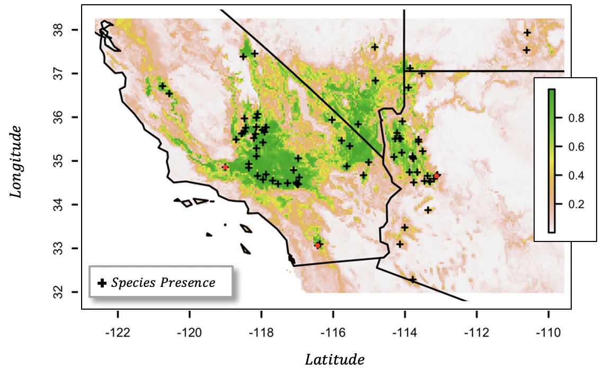
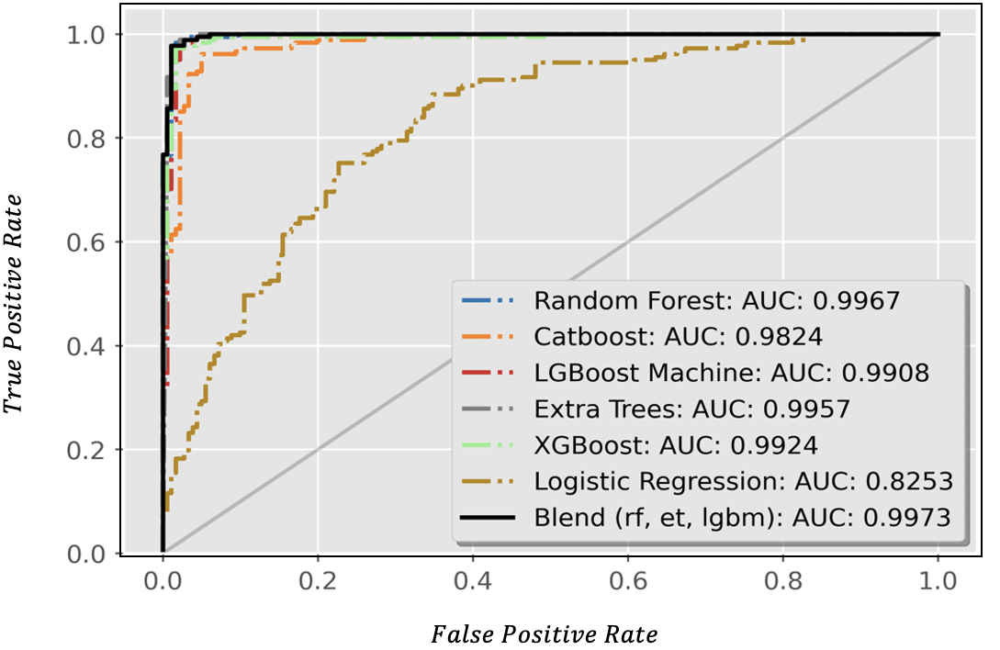

## Assessing Climate Change Impacts on *Xantusia vigilis* lizards and their Joshua tree habitats with Ensemble Species Distribution Models

*What can we learn about jointly projecting range models of symbiotic species to future climates? How will climate change impact geographic overlap between Mojave Desert species?*

---

Desert Night Lizard distribution| Validation-set AUC statistics
:-------------------------------------------:|:------------------------------:
 | 

All code and data required to reproduce research presented at the [SICB 2021](https://sicbannualmeeting.pathable.co/meetings/virtual/b5bEwkdpSNA3kaCLq) and [SCCUR 2019](https://drive.google.com/file/d/114wmqQgjkc5DHLQmVI19AvlTw4K_daYQ/view?usp=sharing) conferences. Computational ecology research driving effective biodiversity conservation in the Mojave Desert. [`Comparing_MLs.ipynb`](https://nbviewer.jupyter.org/github/daniel-furman/ensemble-climate-projections/blob/main/Comparing_MLs.ipynb). 

Conference Publication: (1) DR Furman et al., Society for Integrative and Comparative Biology Meeting, Jan. 3, 2021.; Talk: (2) DR Furman and SK Halvorsen, SCCUR Meeting, Nov. 23, 2019.

### [SICB '21](https://sicbannualmeeting.pathable.co/meetings/virtual/b5bEwkdpSNA3kaCLq) Poster Figures

---

Figure 1/2: `ML_sdms_train.py`; `ML_sdms_predict.py`; `recursive-ranker.py`   
Figure 3/4: `Comparing_MLs.ipynb`   
Figure 5: `pca_benchmark.R`   
Figure 6: `preprocessing_geodata.R`   

### Introduction to study
---

Blends of tree-based machine learning classifiers performed best at predicting the geographic range for *Xantusia vigilis* and *Yucca brevifolia*, a pair of iconic Mojave desert species. The spatial overlap between the two species’ near-current (1970-2000) distributions was ~fifty percent overall (intersection/union) and ~sixty-five percent solely within Xantusia’s geographic range. Across future bioclimatic scenarios, we predicted severe constriction for both species' distributions (Fig. 6) and a significant reduction in their geographic overlap (down by ~56% from baseline conditions, on average). Equipped with these 21st century predictions, we pinpoint areas with a high likelihood of retaining Xantusia and Yucca overlap and suggest ways to target their ecological conservation.

Our research can serve as a case study for projecting joint distributions of symbiotic species to explore ecological climate change affects. Habitat degradation for Mojave Desert species will likely result from changing climate and from discrete events of environmental catastrophe, such as wildfire and drought. Future research will include an assessment of lag between *Xantusia* and *Yucca* shifts, topographic analyses across the species’ geographic ranges, and field work at recently burned
Joshua tree strands near the southern California/Arizona border (see [NYT article](https://www.nytimes.com/interactive/2020/12/09/climate/redwood-sequoia-tree-fire.html?)).

### Programming Workflow

---

* `Data pre-processing` -> `Model fitting` -> `Assessment` -> `Baseline interpolation (1970-2000)` -> `Extrapolation across 21st century`

The `ML_sdms_.py` train and validate ML classifiers. The `recursive-ranker.py` function recursively selected which features to use for the modeling, such that they were below a Spearman's threshold. We used the rank of feature importance scores to decide which variables to drop at each recursive call. These outputs are available in `Comparing_MLs.ipynb`, along with the geospatial predictions for the baseline and future climates. Lastly, `pca_benchmark.R` calculates the similarity between the model interpolation and extrapolation data using a Jacard similarity metric among principal components. 

### Data

---

The input data is located in the `data/` folder. Climate information was stored in 19 bioclimatic features (2.5 arc-minute resolution; baseline 1970-2000; with an extent from 109.3°W to 122.8°W and 31.9°N to 38.2°N), downloaded from the publicly available [WorldClim database](https://www.worldclim.org) (v. 2.1, Fick & Hijmans, 2017). Presence data were downloaded from the publicly available Global Biodiversity Information Facility database ([GBIF](https://www.gbif.org), downloaded November 1, 2020) and from Leavitt et al., 2007. In addition, the most recently updated climate forecasts were obtained from [CMIP6](https://www.worldclim.org/data/cmip6/cmip6_clim2.5m.html), also from the WorldClim database. 

